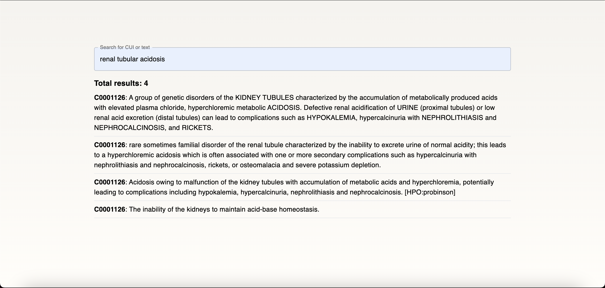
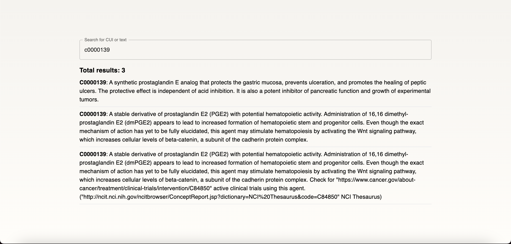

# Unified Medical Language System (UMLS) Mock

- [Unified Medical Language System (UMLS) Mock](#unified-medical-language-system-umls-mock)
  - [Demo](#demo)
  - [Getting Started](#getting-started)
    - [Prequisites](#prequisites)
    - [Installation](#installation)
  - [Features \& Usage](#features--usage)
  - [Devlopment](#devlopment)
    - [Prerequisites](#prerequisites)
    - [1. 找到定義檔案以及其格式](#1-找到定義檔案以及其格式)
    - [2. 使用 Python 撰寫腳本將 .RRF 轉換成 .csv](#2-使用-python-撰寫腳本將-rrf-轉換成-csv)
    - [3. 將 .csv 匯入 Postgres](#3-將-csv-匯入-postgres)
    - [4. 後端 Entity, Repository, Service, Controller](#4-後端-entity-repository-service-controller)
    - [5. 前端介面](#5-前端介面)
    - [6. TODO: 應用 MetaMapLite 時添加模糊搜尋的功能](#6-todo-應用-metamaplite-時添加模糊搜尋的功能)
  - [MetaMapLite](#metamaplite)
    - [Download MetaMapLite](#download-metamaplite)
    - [MetaMapLite Documents](#metamaplite-documents)

## Demo

**Demo 1: Search By Text**



**Demo 2: Search By CUI** (Case Insensitive: 不分大小寫)



## Getting Started

> 一些連結待補充

### Prequisites

- (可跳過)下載 UMLS Dataset，因為已經轉換好放在伺服器資料庫上了。如果想導入在自己的資料庫檔案在 `./umls-data/MRDEF.csv`
- 安裝 MetaMapLite：用於將用戶輸入的詞彙映射到相應的 CUI。安裝方法與置放路徑請參考[Download MetaMapLite](#download-metamaplite)
- Java Spring Boot 3 with Java SDK 20+: 後端服務器框架，其他 Java 版本要修改 pom.xml
- 連接伺服器上的 PostgreSQL(稍後新增連線資訊在`.env`)
  - 另外可以搭配使用 Intellij 連接(Database -> '+' -> Data Source -> PostgreSQL -> 填入連線資訊)
- Node.js 14+

### Installation

1.  Clone the repo

    ```sh
    git clone https://github.com/CARRYUU/umls-search
    ```

    或使用 ssh

    ```sh
     git clone git@github.com:CARRYUU/umls-search.git
    ```

2.  前往後端資料夾安裝 Maven packages

    ```sh
    cd server
    mvn install
    ```

3.  修改後端環境變數

    `.env` 放置在 `server/src/main/resources` 資料夾下，

    ```sh
    cd server/src/main/resources
    cp .env.example .env # 複製範例檔案 .env.example 到 .env
    vi .env
    ```

    請修改以下環境變數

    ```sh
    POSTGRESQL_DATABASE=<放置DB連線URI>
    DB_USERNAME=<放置DB帳號>
    DB_PASSWORD=<放置DB密碼>
    ```

4.  運行後端伺服器

    ```sh
    cd ../..
    mvn spring-boot:run
    ```

    接下來要運行前端伺服器，打開新的 terminal

5.  前往前端資料夾安裝 NPM packages

    更新 npm

    ```sh
    npm install npm@latest -g
    ```

    到前端資料夾安裝 NPM 套件

    ```sh
    cd client
    npm install
    ```

6.  運行前端伺服器 Next.js

    於開發模式運行

    ```sh
    npm run dev
    ```

    接下來就可以在瀏覽器開啟 `http://localhost:3000` 進行測試。

    如果要在生產模式運行，請先建置

    ```sh
    npm run build
    ```

    再運行

    ```sh
    npm run start
    ```

## Features & Usage

**後端 API**

- [x] 透過 CUI 搜尋其定義

      測試: `http://localhost:8080/api/v1/umls/search/text/renal tubular acidosis`

- [x] 透過輸入文字搜尋其 CUIs 以及其定義

      測試: `http://localhost:8080/api/v1/umls/search/cui/C0000039`

**前端**

- [x] 搜尋介面

**遭遇問題**

MetaMapLite 不支援模糊搜尋(都較 Lite 要求快了當然不要模糊搜尋!)，因此輸入字串只能找到一個 CUI。然而一個 UMLS API 支援輸入文本字串進行模糊搜尋，可以得到多個 CUIs，對於查詢來說應該是比較好的。

使用 MetaMapLite 搜尋: `renal tubular acidosis` 只會得到 CUI `C0001126`


但使用 UMLS 官網提供的 API 搜尋 `renal tubular acidosis` 會得到多個 CUIs


解決方法: 使用 MetaMapLite 前先對輸入文本進行預處理，以達到模糊搜尋的效果。模糊搜尋會降低效率，不適合於比對時使用，但對於查詢時是必要的。

## Devlopment

### Prerequisites

為了實現這個 UMLS 搜索系統，需要以下工具和技術：

- UMLS Dataset
- MetaMapLite：用於將用戶輸入的詞彙映射到相應的 CUI。安裝方法可參考[Download MetaMapLite](#download-metamaplite)
- Java Spring Boot 3 with Java SDK 20+: 後端服務器框架
- PostgreSQL: 用於存儲 UMLS 數據的數據庫。CUI, Definition
- Python 3.8+: 用於將 UMLS 數據轉換為 CSV 文件
- Node.js 14+: 用於構建前端界面

開始動工!

### 1. 找到定義檔案以及其格式

到官網[UMLS Knowledge Sources: File Downloads](https://www.nlm.nih.gov/research/umls/licensedcontent/umlsknowledgesources.html)下載 **UMLS Metathesaurus Level 0 Subset(NEW as of 2022AB)** 或其他版本。

看一下表格定義 [Definitions (File = MRDEF.RRF)](https://www.ncbi.nlm.nih.gov/books/NBK9685/table/ch03.T.definitions_file_mrdef_rrf/?report=objectonly)

| Col.     | Description                                                                                                                                                               |
| -------- | ------------------------------------------------------------------------------------------------------------------------------------------------------------------------- |
| CUI      | Unique identifier for concept                                                                                                                                             |
| AUI      | Unique identifier for atom - variable length field, 8 or 9 characters                                                                                                     |
| ATUI     | Unique identifier for attribute                                                                                                                                           |
| SATUI    | Source asserted attribute identifier [optional-present if it exists]                                                                                                      |
| SAB      | Abbreviated source name (SAB) of the source of the definition。                                                                                                           |
| DEF      | Definition                                                                                                                                                                |
| SUPPRESS | Suppressible flag. Values = O, E, Y, or N. Reflects the suppressible status of the attribute; not yet in use. See also SUPPRESS in MRCONSO.RRF, MRREL.RRF, and MRSAT.RRF. |
| CVF      | Content View Flag. Bit field used to flag rows included in Content View. This field is a varchar field to maximize the number of bits available for use.                  |

看起來我們需要提取以下字段：

- `CUI`：概念的唯一標識符。
- `DEF`：定義。

### 2. 使用 Python 撰寫腳本將 .RRF 轉換成 .csv

因為對於 Postgres 來說 .csv 比較好匯入，所以寫個腳本轉個檔。

```python
import csv

def convert_rrf_to_csv(rrf_file, csv_file):
    with open(rrf_file, 'r', encoding='utf-8') as rrf, open(csv_file, 'w', encoding='utf-8', newline='') as csv_out:
        csv_writer = csv.writer(csv_out, delimiter=',', quotechar='"', quoting=csv.QUOTE_MINIMAL)

        for line in rrf:
            fields = line.strip().split('|')

            # 只選擇cui和definition欄位，即索引0和5
            selected_fields = [fields[0], fields[5]]
            csv_writer.writerow(selected_fields)

if __name__ == "__main__":
    rrf_file = '../MRDEF.RRF'  # 替換為RRF文件路徑
    csv_file = '../MRDEF.csv'  # 希望保存的CSV文件路徑
    convert_rrf_to_csv(rrf_file, csv_file)
```

### 3. 將 .csv 匯入 Postgres

導入時發現一個問題: 一個 CUI 可能會對應到多個 Definitions。如 CUI=C0000097 就有兩個 Definitions

因此需要添加一個自動遞增的 id 作為主鍵。

這邊使用 PgAdmin 中的 Query Tools 建立一個表格

```sql
CREATE TABLE umls_terms (
    id SERIAL PRIMARY KEY,
    cui VARCHAR(255) NOT NULL,
    definition TEXT NOT NULL
);
```

右鍵單擊 `umls_terms` 表，然後選擇**Import/Export**。在彈出的窗口中，選擇以下選項：

- 選擇**導入**。
- 文件名：選擇剛才生成的 CSV 文件。
- 格式：選擇 **csv**。
- 編碼：選擇“**UTF8**”。
- 分隔符：選擇逗號 `,`。
- 引用字符：選擇雙引號 `"`。
- 跳脫字元: 無。
- **Columns to import**: 選擇 `cui` 和 `definition`就好。
  選擇“開始”。

資料庫部分完成!

### 4. 後端 Entity, Repository, Service, Controller

裝好 MetaMapLite，在使用 Spring Initializer 建立一個 Spring Boot 專案。

在 Java Spring Boot 3 中，需要以下依賴項(Dependencies)：

- Spring Boot Starter Data JPA：用於簡化數據庫操作。
- Spring Boot Starter Web：用於構建 Web 服務。
- PostgreSQL JDBC Driver：用於連接到 PostgreSQL 數據庫。

### 5. 前端介面

- 前端框架：Next.js
- UI 組件庫：Material-UI 或 Ant Design
- HTTP 客戶端庫：Axios
- 錯誤追踪和監控：Sentry
- 防抖(Debounce)和節流：[use-debounce](https://www.npmjs.com/package/use-debounce)

處理問題

- 後端記得要設置 CORS
- .ENV: Next 專案的環境變數放置在`.env.local`中，並且要以`NEXT_PUBLIC_`開頭，才能在前端瀏覽器使用。

### 6. TODO: 應用 MetaMapLite 時添加模糊搜尋的功能

使用 [Apache Lucene 9](https://lucene.apache.org/)

- [Apache Lucene MVN Repository](https://mvnrepository.com/artifact/org.apache.lucene/lucene-core)
- [開源全文檢索、搜尋函式庫 Apache Lucene 9.0 效能大幅提升](https://www.ithome.com.tw/news/148360)

解析 MRCONSO.RRF?

## MetaMapLite

### Download MetaMapLite

1. Download [MetaMapLite](https://lhncbc.nlm.nih.gov/ii/tools/MetaMap/run-locally/MetaMapLite.html)
2. Create a folder named `metamaplite` in the root directory of this project.
3. Unzip the downloaded file and move the `public_mm_lite` folder into the `metamaplite` folder.
4. Put the UMLs Dataset folders into the `public_mm_mm_lite/data/ivf` folder.

It should look like this:

```bash
.
└── umls-search/
    ├── ...
    ├── lib/
    ├── metamaplite/
    │   └── public_mm_lite/       # MetaMapLite
    │       ├── ...
    │       └── data/
    │           ├── ...
    │           └── ivf/          # UMLS Dataset
    │               ├── 2022AA
    │               └── 2022AB
    └── src
```

Then, install metamaplite and dependencies into local Maven repository.

```bash
$ cd metamaplite/public_mm_lite

$ mvn install:install-file \
    -Dfile=lib/context-2012.jar \
    -DgroupId=context \
    -DartifactId=context \
    -Dversion=2012 \
    -Dpackaging=jar

$ mvn install:install-file \
    -Dfile=lib/bioc-1.0.1.jar \
    -DgroupId=bioc \
    -DartifactId=bioc \
    -Dversion=1.0.1 \
    -Dpackaging=jar

$ mvn install:install-file \
    -Dfile=lib/nlp-2.4.C.jar \
    -DgroupId=gov.nih.nlm.nls \
    -DartifactId=nlp \
    -Dversion=2.4.C \
    -Dpackaging=jar

$ mvn install:install-file  \
    -Dfile=lib/lvgdist-2020.0.jar \
    -DgroupId=gov.nih.nlm.nls.lvg \
    -DartifactId=lvgdist \
    -Dversion=2020.0 \
    -Dpackaging=jar
```

Then install metamaplite into your local Maven repository:

```bash
$ mvn install
```

補:

我在 macOS 上沒有問題，但使用 Windows 系統得先把 `~/public_mm_lite/src/test/java` 裡面的 `irutils/` 資料夾刪掉才能成功安裝。

### MetaMapLite Documents

- [MetaMapLite 3.6.2rc5 README Documentation](https://lhncbc.nlm.nih.gov/ii/tools/MetaMap/Docs/README_MetaMapLite_3.6.2rc5.html)
- [MetaMapLite Github Page](https://github.com/lhncbc/metamaplite)
